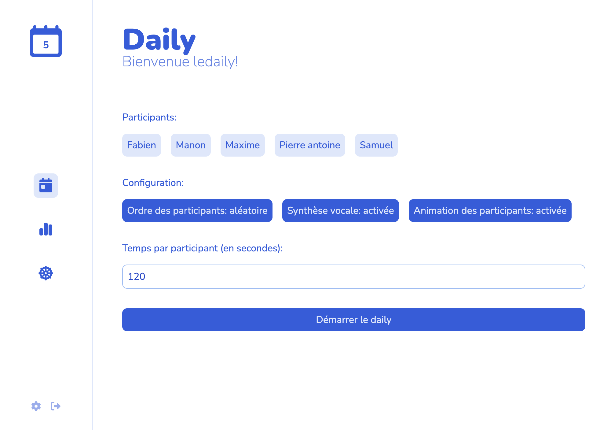
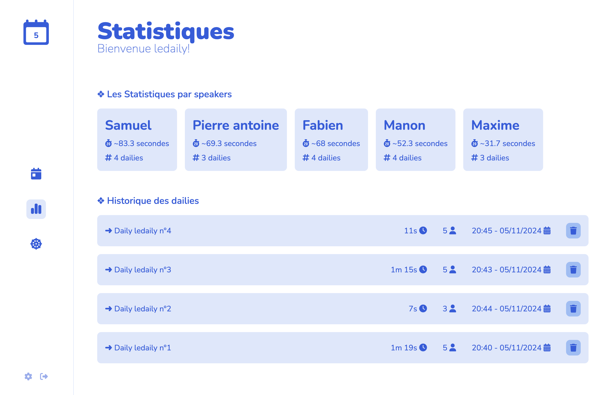
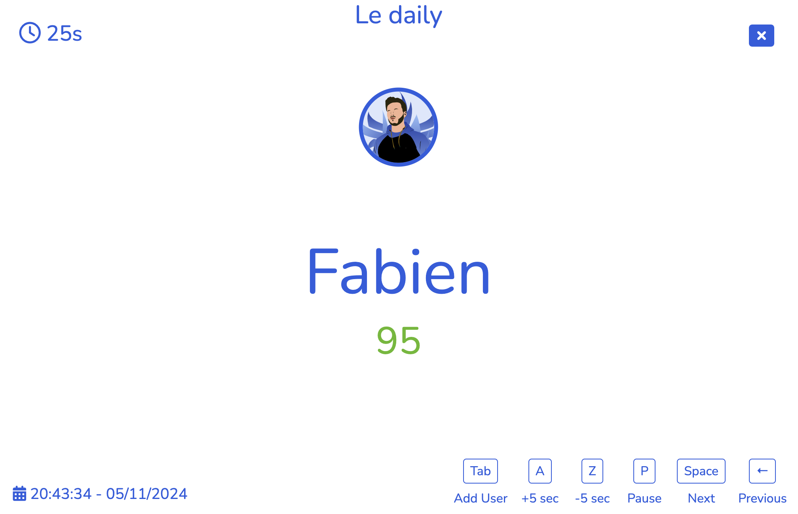
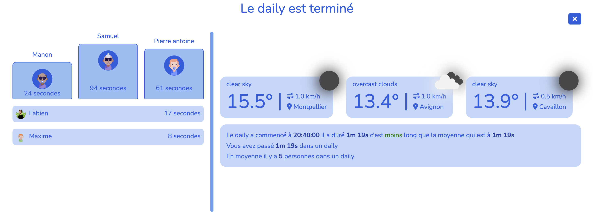

# Le Daily

**Le Daily** is a web application designed to streamline and structure daily stand-up meetings for development teams. This tool helps track participants, manage speaking times, and introduces interactive elements to make meetings more engaging.

## Project Goals

The main goal of Le Daily is to provide a simple, effective tool for organizing daily stand-ups, ensuring that each participant has an opportunity to speak and that the meetings remain on schedule. Key features include:

- User management and speaking time tracking
- Animated transitions for an enhanced user experience
- Daily task and goal tracking
- Integration with third-party services for additional information (such as weather updates, lottery results, etc.)

## Features
- **User Management:** Add, remove, and manage participants attending the stand-up meetings.
- **Animated Transitions:** Uses Svelte transitions to create a more dynamic, interactive application.
- **Integrations:** Displays relevant information, including weather forecasts and EuroMillions lottery results.
- **Speaking Time Tracking:** Times each contribution to ensure participants stay within their allocated speaking time.
- **Celebratory Animations:** Adds festive animations, like confetti, to celebrate achievements.

## Testing

You can try out Le Daily right now at https://ledaily.vercel.app/!

Use the following credentials to log in:

- **Username:** ledaily
- **Password:** ledaily

We encourage you to test **Le Daily** with __your team__ and see how it can simplify and enhance your daily stand-up meetings! 

## Captures d'écran

Here are a few screenshots of the application:

### Configure new daily


### Statistics on Past Dailies


### Selected Speaker


### Summary of Completed Daily


## Development
To get started with the project, install dependencies using`npm install` (or `pnpm install` or `yarn`), then start a development server:

```bash
npm run dev

# Or, to start the server and open the app in a new browser tab automatically:
npm run dev -- --open


## Building

To create a production version of your app:

```bash
npm run build
```

You can preview the production build with `npm run preview`.

> To deploy your app, you may need to install an [adapter](https://kit.svelte.dev/docs/adapters) for your target environment.
